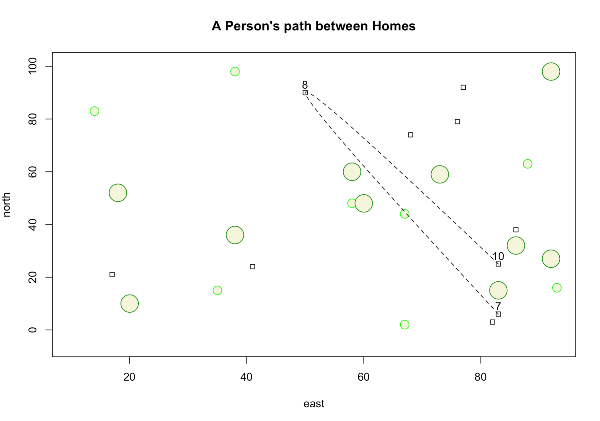
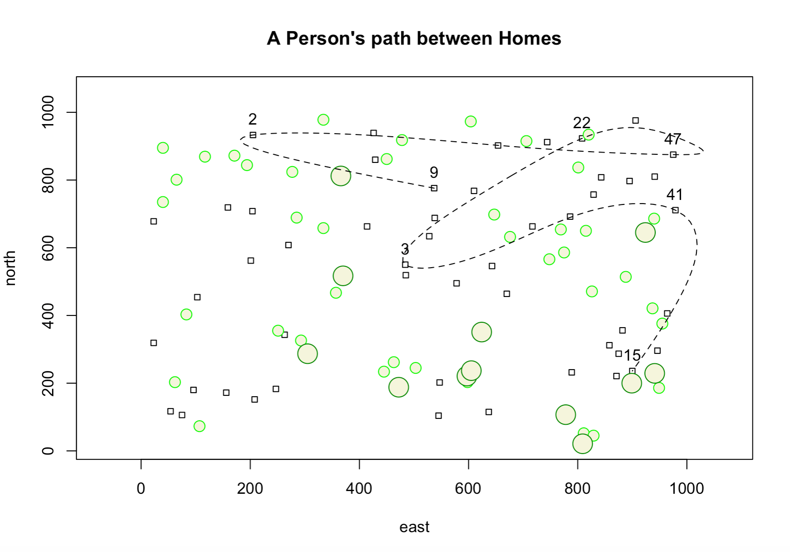

# 1.4 Exercise

### Challenge

## Code

    # Original ----------------------------------------------------------------

    x <- 1:100
    y <- 1:100
    east <- sample(x, size = 10, replace = TRUE) #selecting random coordinates
    north <- sample(y, size = 10, replace = TRUE) #^
    symbols(east, north, squares = rep(.75,10), inches = FALSE) #creating squares at the random coordinates

    symbols(sample(x, 10, replace = TRUE), 
            sample(y, 10, replace = TRUE), 
            circles = rep(.75,10), 
            inches = FALSE,
            fg = "green1",
            bg = "beige",
            add = TRUE) #create small trees

    symbols(sample(x, 10, replace = TRUE), 
            sample(y, 10, replace = TRUE), 
            circles = rep(1.5,10), 
            inches = FALSE,
            fg = "green4",
            bg = "beige",
            add = TRUE) # create large trees

    dwellings <- cbind.data.frame(id = 1:10, east, north) #data frame with dwelling id and random locations

    lines(x = dwellings$east,
          y = dwellings$north,
          lty = 2,
          lwd = .75,
          col = "blue") #create straight path between the dwellings

    text(x = dwellings$east,
         y = dwellings$north,
         labels = dwellings$id) #label the dwellings

    locs <- sample(1:10, 3, replace = FALSE) #select 3 random dwellings

    lines(x = dwellings[locs, 2],
          y = dwellings[locs, 3],
          lty = 2,
          lwd = .75,
          col = "blue") #makes straight path between 3 selected dwellings

    text(x = dwellings[locs, ]$east, 
         y = dwellings[locs, ]$north + 3,
         labels = dwellings[locs, ]$id) #labels 3 random dwellings

    xspline(x = dwellings[locs, 2],
            y = dwellings[locs, 3],
            shape = -1,
            lty = 2) #create rounded path between dwellings

    title(main="A Person's path between Homes")

    # Challenge ---------------------------------------------------------------

    x <- 1:1000
    y <- 1:1000

    east <- sample(x, size = 50, replace = TRUE) #selecting random coordinates
    north <- sample(y, size = 50, replace = TRUE) #^
    symbols(east, north, squares = rep(10,50), inches = FALSE) #creating squares at the random coordinates

    symbols(sample(x, 40, replace = TRUE), 
            sample(y, 40, replace = TRUE), 
            circles = rep(10,40), 
            inches = FALSE,
            fg = "green1",
            bg = "beige",
            add = TRUE) #create small trees

    symbols(sample(x, 12, replace = TRUE), 
            sample(y, 12, replace = TRUE), 
            circles = rep(18,12), 
            inches = FALSE,
            fg = "green4",
            bg = "beige",
            add = TRUE) #create large trees

    dwellings <- cbind.data.frame(id = 1:50, east, north) #data frame with dwelling id and random locations

    locs <- sample(1:50, 7, replace = FALSE) #select 7 random dwellings

    text(x = dwellings[locs, ]$east, 
         y = dwellings[locs, ]$north + 3,
         labels = dwellings[locs, ]$id,
         pos = 3) #label 7 random dwellings

    xspline(x = dwellings[locs, 2],
            y = dwellings[locs, 3],
            shape = -1,
            lty = 2) #create rounded path between dwellings

    title(main="A Person's path between Homes")

